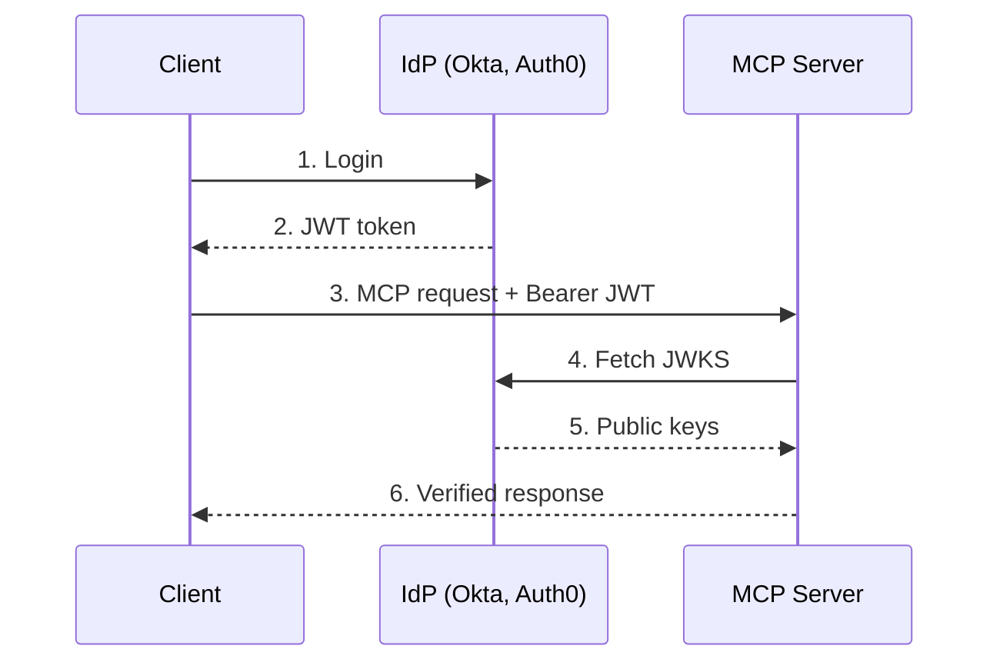
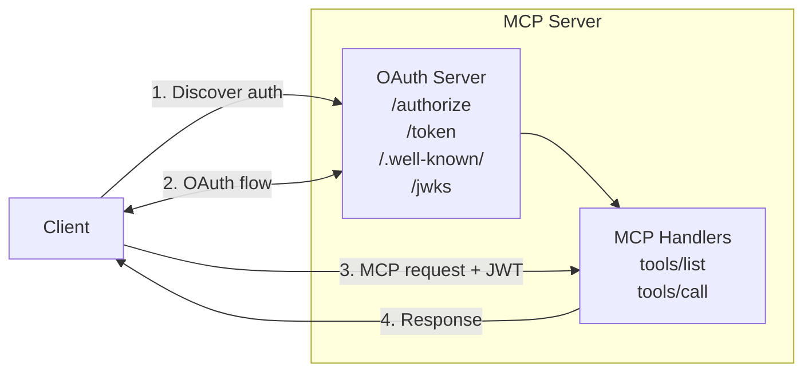
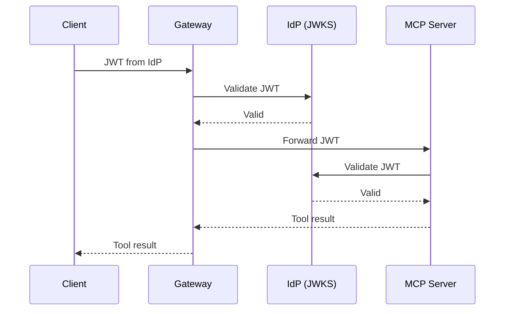

## Beyond Basic Auth

Most MCP server tutorials show a simple setup: one server, one user, basic API key authentication. Enterprise environments look different:

- Hundreds or thousands of users across multiple teams
- Existing identity providers (Okta, Auth0, Microsoft Entra ID) managing authentication
- Compliance requirements for audit trails and access control
- Zero-trust networks where every request must be verified

When you deploy MCP servers in this environment, you need authentication that scales beyond environment variable API keys. You need token-based authentication with cryptographic verification — and that means JWKS.

_This is Part 2 of a three-part series on MCP authentication. [Part 1](/blog/mcp-authentication-guide) covers the full MCP auth landscape — OAuth 2.1, PKCE, discovery, and client registration. [Part 3](/blog/enterprise-managed-authorization-mcp) covers enterprise-managed authorization and ID-JAG._

## What is JWKS?

JSON Web Key Set (JWKS) is a standard (RFC 7517) for publishing public keys that verify JWT signatures. Instead of sharing secrets between services, the identity provider publishes its public keys at a well-known URL:

```
https://auth.example.com/.well-known/jwks.json
```

The response contains the public keys:

```json
{
  "keys": [
    {
      "kty": "RSA",
      "kid": "key-2026-01",
      "use": "sig",
      "alg": "RS256",
      "n": "0vx7agoebGcQSuu...",
      "e": "AQAB"
    }
  ]
}
```

Any service can fetch these keys and verify JWT signatures without contacting the identity provider on every request. This is the foundation of **stateless token validation** — the MCP server can verify tokens independently.

## Two Architecture Patterns

When building enterprise MCP servers with third-party identity providers, there are two main patterns.

### Pattern 1: Third-Party IdP (JWT Validation)

The MCP server delegates authentication entirely to an external identity provider. The server never issues tokens — it only validates them.



The MCP server:

1. Receives a JWT in the `Authorization: Bearer` header
2. Fetches the IdP's JWKS (cached, refreshed every few minutes)
3. Verifies the JWT signature using the matching public key
4. Checks standard claims: `iss` (issuer), `aud` (audience), `exp` (expiry)
5. Extracts user identity from claims (`sub`, `email`, custom claims)

**Best for:** MCP servers deployed in environments with an existing IdP. The server has zero auth infrastructure of its own — all authentication is handled externally.

> **Working example:** See the [MCP Server + Keycloak JWKS example](https://github.com/archestra-ai/examples/tree/main/mcp-server-jwks-keycloak) for a fully self-contained implementation of this pattern with Keycloak, role-based tool access, and an end-to-end test — all runnable with a single `docker compose up`.

### Pattern 2: Built-in OAuth Server

The MCP server runs its own OAuth authorization server. It issues tokens, manages user sessions, and publishes its own JWKS endpoint.



**Best for:** Standalone MCP servers or products that need full control over the auth experience. The server owns user management and token issuance.

### Choosing Between Them

- **User management** — Third-Party IdP: external (Okta, Entra ID). Built-in OAuth: in the MCP server.
- **Setup complexity** — Third-Party IdP: lower (just validate JWTs). Built-in OAuth: higher (run full OAuth server).
- **SSO integration** — Third-Party IdP: native. Built-in OAuth: requires federation.
- **Token format** — Third-Party IdP: defined by IdP. Built-in OAuth: you control it.
- **Best for** — Third-Party IdP: enterprise, multi-tenant. Built-in OAuth: standalone products.

In practice, most enterprise deployments use Pattern 1 because the organization already has an identity provider. The MCP server becomes another relying party in the existing identity infrastructure.

## Implementing JWT Validation with JWKS

Here's a practical implementation for an MCP server that validates JWTs from any OIDC-compliant identity provider.

### JWKS Client

The `jose` library handles JWKS fetching, caching, key rotation, and `kid` matching out of the box:

```typescript
import * as jose from 'jose';

// jose manages caching and key rotation internally
const JWKS = jose.createRemoteJWKSet(new URL('https://your-idp.com/.well-known/jwks.json'));

async function verifyToken(token: string, expectedAudience: string) {
  const { payload } = await jose.jwtVerify(token, JWKS, {
    audience: expectedAudience,
    clockTolerance: 30, // seconds of leeway for clock skew
  });

  return {
    userId: payload.sub,
    email: payload.email as string,
    roles: (payload.roles as string[]) ?? [],
    organizationId: payload.org_id as string,
  };
}
```

### Auth Middleware

Extract the Bearer token and validate before processing MCP requests:

```typescript
async function authenticateRequest(req: Request) {
  const authHeader = req.headers.get('authorization');
  if (!authHeader?.startsWith('Bearer ')) {
    return new Response('Unauthorized', {
      status: 401,
      headers: {
        'WWW-Authenticate':
          'Bearer resource_metadata="https://your-server.example/.well-known/oauth-protected-resource"',
      },
    });
  }

  const token = authHeader.slice(7);
  return verifyToken(token, 'https://your-server.example');
}
```

Note the `WWW-Authenticate` header in the 401 response — this is required by the MCP spec so clients can discover the auth server and start the OAuth flow automatically.

### MCP Server Integration

Wire the auth middleware into your MCP tool handlers:

```typescript
import { McpServer } from '@modelcontextprotocol/sdk/server/mcp.js';
import { z } from 'zod';

const server = new McpServer({
  name: 'enterprise-server',
  version: '1.0.0',
});

server.tool('query-database', { query: z.string() }, async (params, context) => {
  const user = context.auth;

  if (!user.roles.includes('db-reader')) {
    throw new Error('Insufficient permissions');
  }

  // Execute query scoped to user's org
  const results = await db.query(params.query, {
    organizationId: user.organizationId,
  });

  return { content: [{ type: 'text', text: JSON.stringify(results) }] };
});
```

## MCP-Spec Discovery Endpoints

For your MCP server to work with standard MCP clients (Claude Desktop, Cursor, etc.), it needs to implement the discovery endpoints from the [MCP Authorization spec](https://modelcontextprotocol.io/specification/2025-11-25/basic/authorization).

### Protected Resource Metadata (RFC 9728)

Serve this at `/.well-known/oauth-protected-resource`:

```json
{
  "resource": "https://your-server.example",
  "authorization_servers": ["https://your-tenant.auth0.com"],
  "scopes_supported": ["mcp:tools", "mcp:resources"]
}
```

The `authorization_servers` array points MCP clients to your IdP. They'll fetch the IdP's `/.well-known/oauth-authorization-server` metadata next and handle the full OAuth flow themselves.

### The 401 Challenge

When a client connects without a valid token, return:

```http
HTTP/1.1 401 Unauthorized
WWW-Authenticate: Bearer resource_metadata="https://your-server.example/.well-known/oauth-protected-resource"
```

Standard MCP clients handle this automatically — they follow the discovery chain, authenticate with the IdP, and retry with a Bearer token.

## Configuring Identity Providers

### Auth0

1. Create an API in Auth0 Dashboard > APIs
2. Set the Identifier (this becomes the `audience` in token requests)
3. Configure your MCP server:

```
JWKS_URI=https://your-tenant.auth0.com/.well-known/jwks.json
EXPECTED_ISSUER=https://your-tenant.auth0.com/
EXPECTED_AUDIENCE=https://your-mcp-server.example.com
```

Auth0 JWTs include `sub` (user ID), `email`, and any custom claims you configure via Actions or Rules.

### Okta

1. Create an Authorization Server in Okta Admin > Security > API
2. Add a scope for your MCP server (e.g., `mcp:tools`)
3. Configure:

```
JWKS_URI=https://your-org.okta.com/oauth2/default/v1/keys
EXPECTED_ISSUER=https://your-org.okta.com/oauth2/default
EXPECTED_AUDIENCE=api://your-mcp-server
```

### Microsoft Entra ID (Azure AD)

1. Register an application in Azure Portal > App Registrations
2. Expose an API with a scope
3. Configure:

```
JWKS_URI=https://login.microsoftonline.com/{tenant-id}/discovery/v2.0/keys
EXPECTED_ISSUER=https://login.microsoftonline.com/{tenant-id}/v2.0
EXPECTED_AUDIENCE=api://{client-id}
```

Entra ID tokens include `oid` (object ID), `preferred_username`, `roles`, and group membership claims.

## Key Rotation

Identity providers rotate their signing keys periodically. Your JWKS implementation must handle this:

1. **Cache with TTL** — refresh the JWKS every 5-10 minutes, not on every request
2. **Key ID (`kid`) matching** — JWTs include a `kid` header that maps to a specific key in the JWKS
3. **Unknown `kid` fallback** — if you see a `kid` that's not in your cache, force-refresh the JWKS before rejecting the token

The `jose` library's `createRemoteJWKSet` handles all three automatically:

```typescript
// Handles caching, key matching, and rotation out of the box
const JWKS = jose.createRemoteJWKSet(new URL('https://your-idp.com/.well-known/jwks.json'));

// Finds the right key by kid, refreshes cache on unknown kid
const { payload } = await jose.jwtVerify(token, JWKS, {
  audience: 'https://your-server.example',
});
```

## Security Checklist

Before deploying your MCP server with JWKS-based auth:

- **Validate `iss` (issuer)** — reject tokens from unexpected issuers
- **Validate `aud` (audience)** — reject tokens not intended for your server
- **Check `exp` (expiry)** — reject expired tokens (allow small clock skew with `clockTolerance`)
- **Use HTTPS for JWKS** — never fetch keys over plaintext HTTP in production
- **Cache JWKS** — don't fetch on every request, but do refresh periodically
- **Handle key rotation** — force-refresh on unknown `kid` before failing
- **Log auth failures** — maintain an audit trail for security review
- **Return proper 401** — include `WWW-Authenticate` header per MCP spec

## When to Use a Gateway Instead

If your organization runs multiple MCP servers, implementing auth in each one creates duplicated effort. An MCP gateway handles authentication at the edge:

- Clients authenticate once with the gateway
- The gateway validates tokens, resolves upstream credentials, and routes tool calls
- Individual MCP servers run without auth logic

This is the **gateway-terminated auth** pattern, and it's how most enterprise deployments manage MCP authentication at scale. The gateway handles the OAuth 2.1 dance, CIMD/DCR registration, token validation, and upstream credential management — your MCP servers just process tool calls.

### End-to-End JWKS with JWT Propagation

There's a hybrid pattern that combines gateway convenience with end-to-end identity verification. Instead of terminating auth at the gateway and connecting to upstream servers with separate credentials, the gateway **propagates the caller's original JWT** to the upstream MCP server:



The gateway validates the JWT and enforces access control (team membership, user matching). The upstream MCP server independently validates the same JWT against the IdP's JWKS endpoint and extracts user identity from the claims — roles, groups, email — without any gateway-specific integration.

This pattern is useful when:

- Your MCP servers need to enforce their own access control based on IdP claims
- The same MCP server is deployed both behind a gateway and standalone
- Compliance requires end-to-end identity verification (the server can prove who made each request)

The [Archestra MCP Gateway](https://archestra.ai/docs/platform-mcp-gateway) supports this pattern via its [External IdP JWKS](https://archestra.ai/docs/mcp-authentication#external-idp-jwks) feature. You configure an OIDC identity provider, link it to an MCP Gateway, and the gateway automatically validates and propagates JWTs to upstream servers — both remote HTTP servers and locally orchestrated Kubernetes pods.

The [MCP Server + Keycloak JWKS example](https://github.com/archestra-ai/examples/tree/main/mcp-server-jwks-keycloak) works with both deployment models: standalone (via `docker compose up`) or behind Archestra's gateway with JWT propagation.

## Wrapping Up

JWKS-based authentication gives MCP servers the same security model used by modern web APIs. By delegating authentication to a trusted identity provider and using cryptographic token verification, you get:

- **Stateless validation** — no database lookups or network calls per request
- **Centralized identity** — one IdP for all your MCP servers
- **Standards compliance** — works with any OIDC-compliant provider
- **Automatic key rotation** — handled via JWKS refresh

The MCP ecosystem is converging on these patterns. Building with JWKS and standard identity providers means your MCP servers are ready for enterprise deployment from day one.

If you haven't already, check out [Part 1 of this series](/blog/mcp-authentication-guide) for the full MCP auth landscape — from the initial 401 handshake through discovery, client registration, and PKCE.
